# Exploring Cases and Case Classifications

1.	Make sure you have downloaded NVivo to your computer. If you are a graduate student or faculty, you have access to a free license through our University of Victoria. Alternatively, you can download a trial version from QSR website, just be aware that the trial version only last for 2 weeks, whereas UVic license will last until you are no longer affiliated with the university.

2.	Double-click on your NVivo icon to open the software.
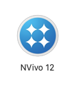

3.	Once the program opens up, click on the top right **create new project** button to open a new project.

    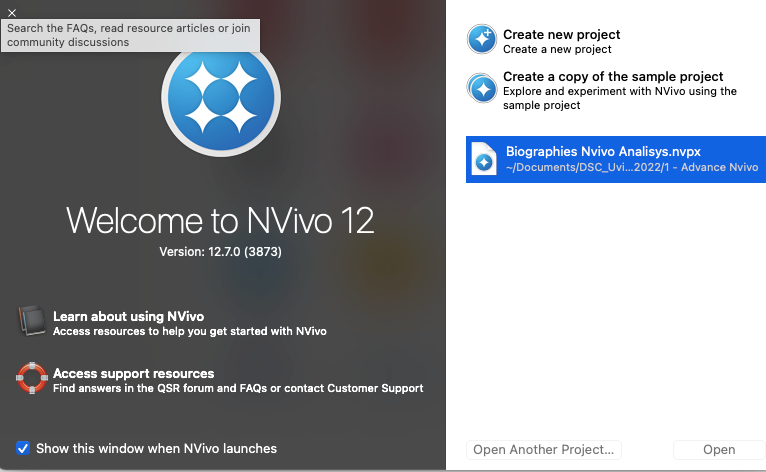
    
    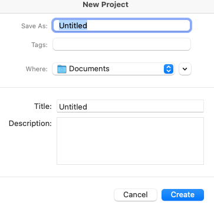

4.	Double click to create a new project. Once you do that you will see the following window and you will be able to name your project, choose a place in your computer to save it in, and add a name and description. We suggest that you name your project _biography analysis._ 

5.	Once you have created your project you will be directed to the NVivo interface to work on the project. If you are using a UVic NVivo license it may look like the image below. If you are using a commercial or trial version, the layout may vary.

    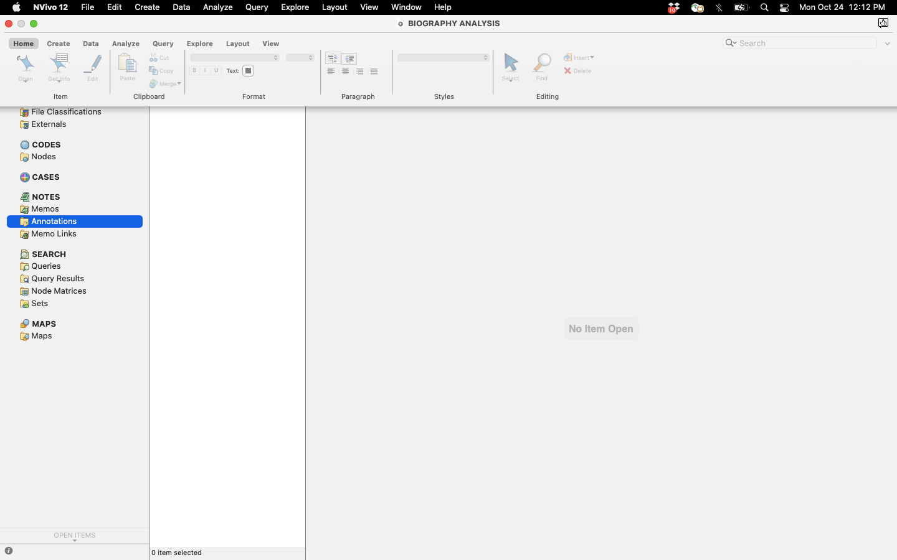

6.	Now, let’s go to **files** on the left pane. Right click on it and choose the option to create a new folder. You should see the following:

    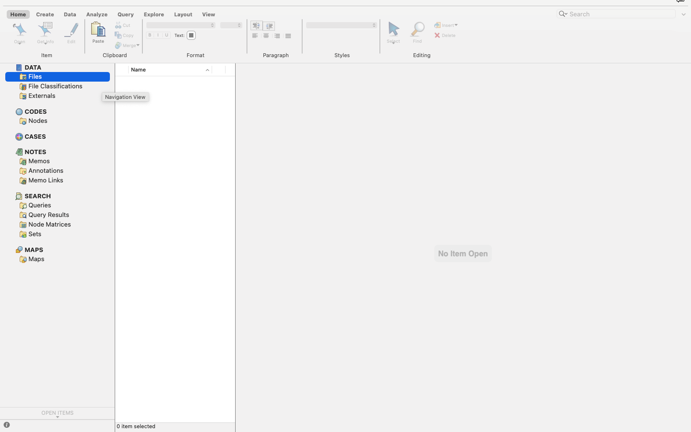
    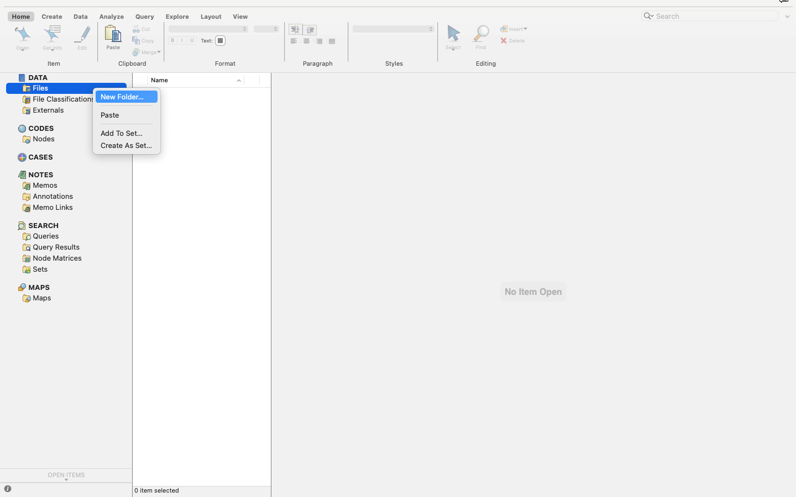

7.	Name your folder **Biographies** (if you want you can add a description for your folder), and click **done.** It is smart to create folders for the files of each project you are working on. This is because you may have multiple NVivo databases for the same project, and we want to have our files properly organized on NVIVO workspace. 

    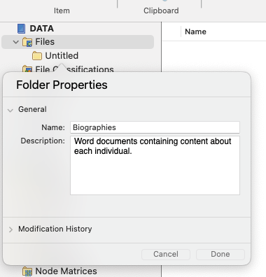

8.	Now that we have set up our NVivo workspace, we will begin to import our files to our project. Below you will find a set of word document files. Please download all documents to your computer. 

    [Link for documents](https://drive.google.com/drive/folders/1CAhi674fobzj0A9N2TTQ4ifPKHsABDXC?usp=sharing)

9.	Once you have all the documents in your computer, import the files to your NVivo. Please keep in mind that this is the same procedure you use to import files in our [introductory NVivo workshop](https://uviclibraries.github.io/nvivo/){:target="_blank"}. To import your files, select the folder you just created called BIOGRAPHIES, then go to the top ribbon and then click DATA -> DOCUMENTS. When a window open, choose the files from your computer and click IMPORT. The second image represents your files imported into Vivo.

    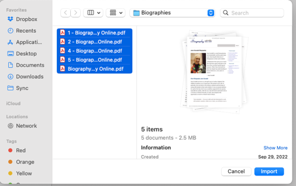
    

10.	Now that you have imported your files into NVivo, we will **turn them into cases** and start our more detailed work. Please remember that when use NVivo, it is always a good idea to keep our NVivo workspace organized, hence, our step by step process. As you make progress on your journey using NVivo, you will see that you can create cases in different manner. We opted for the most pedagogical and easy to do for our workshop today.  So, to turn your files into individual cases, which will allow to create classifications and attributes to each of them, you will go to:

    **BIOGRAPHIES FOLDER UNDER FILE -> SELECT ALL FILES (FROM 1 TO 6) -> RIGHT CLICK ON THE SET -> CHOOSE -> CREATE AS -> CASES**

    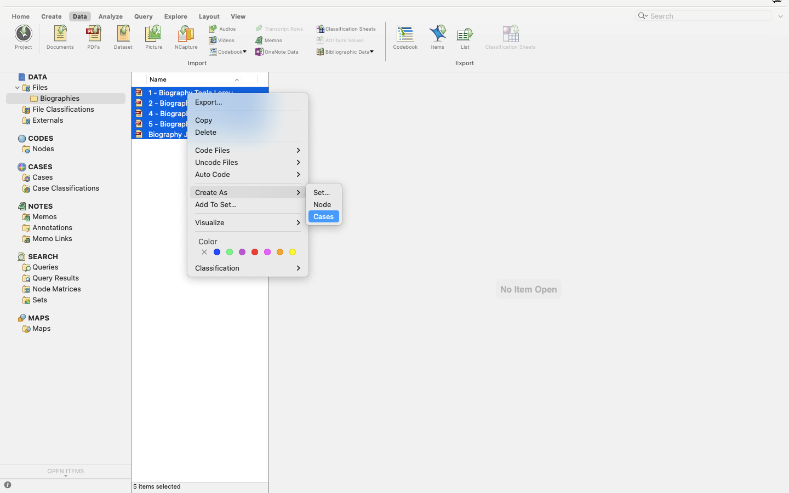

11.	Great. You created your first cases. To see them, go to **CASES** on the left pane and click. You can now see that each individual file is now a unique case that can be further explored. 

    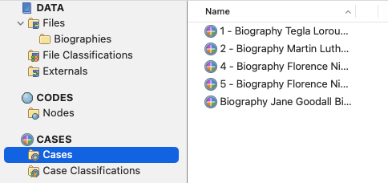

12.	Now that you have yours cases, we will create a classification sheet on NVivo to gather objective information from your data. To do that, select **CASE CLASSIFICATION**, then right click on the detail pane to open the option and click on **NEW CLASSIFICATION**

    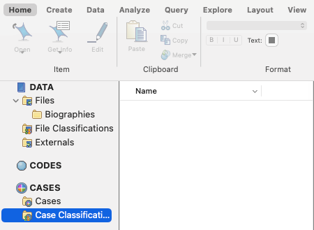

13.	Create your case classification, our suggestion is to name it **ATTRIBUTES FOR BIOGRAPHIES ANALYSIS** as below and click **DONE.**

    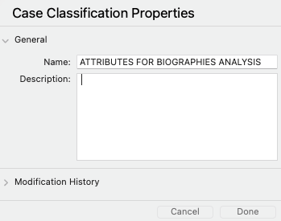

14.	Now, let’s move on and add attributes to our biography case classification sheet. In this case, we want to gather some data from the files which represent a **biographed.** We will gather some information from each such as **gender, country of birth, income level, education level, region where they are from, century, impact level,** among others. In your own project, you can have as many attributes you want. To do that, take your arrow to the detail pane and right click in a blank space, you will see an option to create a **NEW ATTRIBUTE** as below, click on it.

    

15.	Create the following attributes to practice. Please note that you can add as many attributes as you want and as many **ATTRIBUTE PROPERTIES** as you wish.

    -   **GENDER** (male, female, transgender male, transgender female, other)
    -   **INCOME LEVEL** (low, medium, high)
    -   **OCCUPATION**
    -   **STARTING AGE** (0-10, 11-20, 21-30, MORE THAN 30)
    -   **COUNTRY OF BIRTH**
    -   **RACE/ETHINICITY** (Indigenous, Afro-descent, Caucasian, Person of Color) 

    You can detail the attributes to match the ones we suggest above using the + and – in the bottom of the window that pops up:

    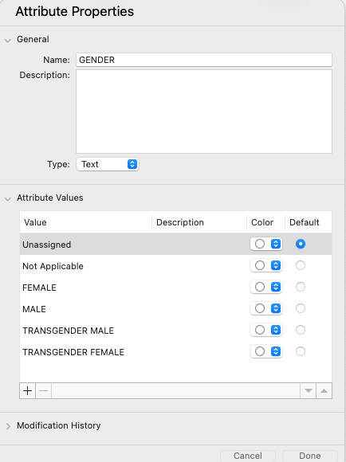

    It will look like this on your NVivo UVic License:

    

16.	Now that your classification sheet is ready, we need to link it to your cases, so we can gather further data from them. To do that, we will go back to **CASES-> SELECT ALL OUR FILES->RIGHT CLICK ON THEM->GO TO THE BOTTOM OF THE LIST ON CLASSIFICATION->CLICK ON “ATTRIBUTES FOR BIOGRAPHIES ANALYSIS”** as below, your NVivo will process the command and link each case to the attribute sheet you created:

    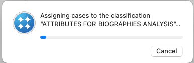

    

17.	Now go to the left pane on **CASE CLASSIFICATION->DOUBLE CLICK IN YOUR “ATTRIBUTES FOR BIOGRAPHIES ANALYSIS” SHEET IN THE MIDDLE OF YOUR NVIVO INTERFACE->ON THE RIGHT SIDE OPEN YOUR CLASSIFICATION SHEET.**

    You will see that your case classification sheet is created and all the attributes and attributes value are there. It will look like the image below:

    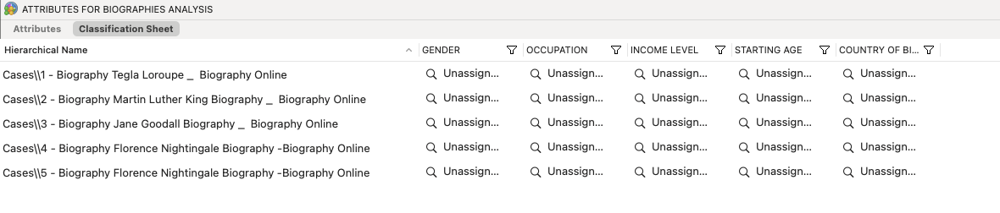

18.	**Let’s begin our analysis.** As you can see, below each attribute there is an unassigned value, you can now click on each of them and start attributing answer to each attribute. In order to do that, you will need to read through the files you imported, they are located in two places (under files and under cases). 

    As you read through your data and find reasonable answers, click in the options on your classification sheet and/ or type in the corresponded information you found. Some of them will have pre-determined information as in between the brackets on step #15, for those that have not, you can type in the information as you find it. It will look like the image below, but keep in mind that every one of you will find your own answers as you analyze the data.

    When you fill up your classification sheet it will look like this:
    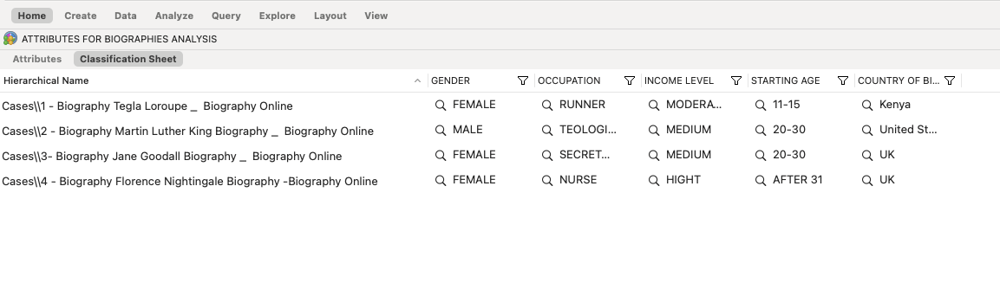

19.	**Let’s explore our data.** Now it is time to play with our data and find out patterns, differences, and so on. Go to the main tab and click on **EXPLORE,** then select attribute values for cases and in the ox right next to it, choose a variable and click **>**

    You should immediately see a **Treemap** with the occurrence of cases per country (in the case of mine). You can then add the other variables by selecting them and clicking >. 
    
    Take a moment to see what happens. You will notice that your Treemap is grouping all of them as you add more information. By exploring the countries, for instance, we can see that most of the cases were born in the UK.

    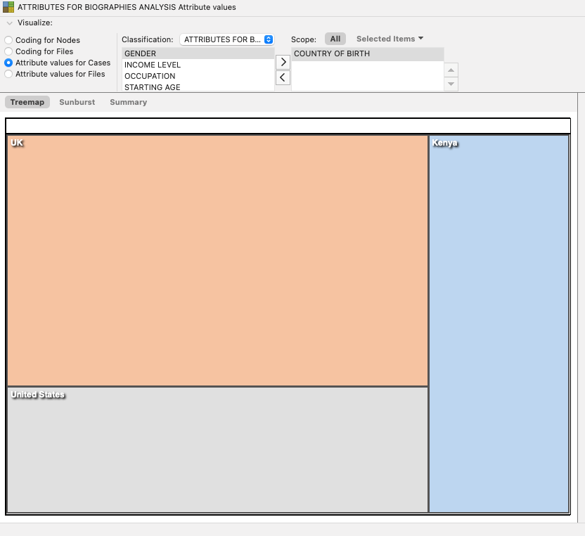

20.	Now, keep exploring and click next to the Treemap where you read **Sunburst**
    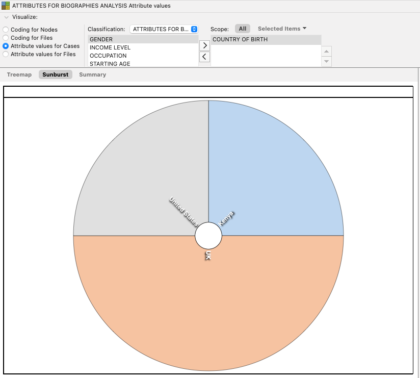

21.	Do the same for **Summary**
    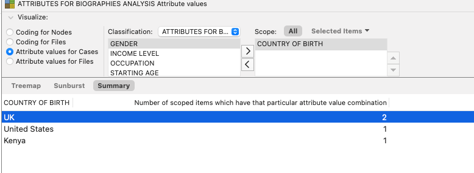

22.	**Exporting your visuals.** As you create your visuals on NVivo 12 Plus UVic license, you can export them to your computer by clicking on the image and choosing Export as below. You can choose the format such as PDF, PNG, JPEG, etc.

    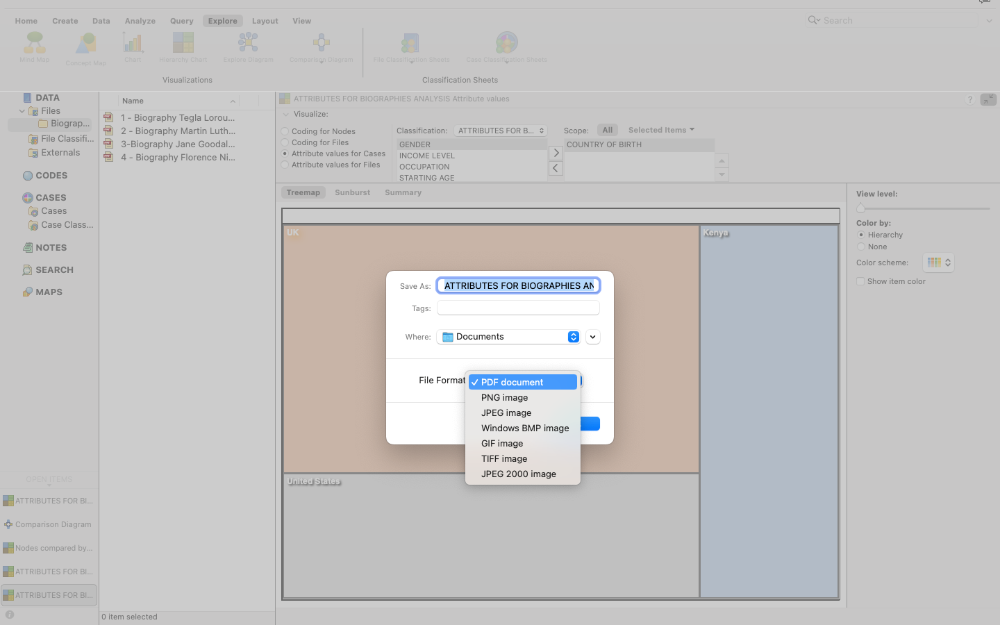

23.	**Comparing Cases.** We can also compare the attribute values of each case to find differences and commonalities between them. On the top ribbon, click on **EXPLORE,** then **COMPARISON DIAGRAM,** then click on **COMPARE CASES.** When a box opens select the case of Jane Goodall and Florence Nightingale and click on **select.**

    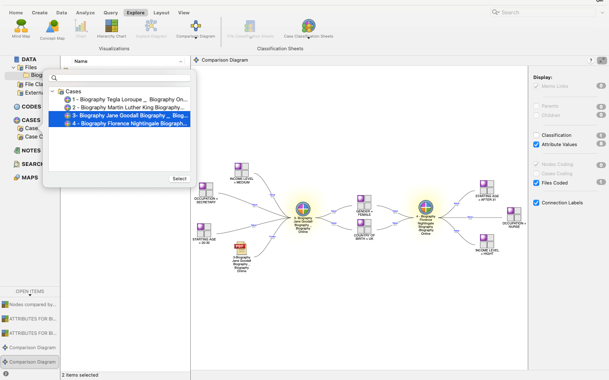

    Once you have done it, you will see a simple display of the connection between a case and a file, drag your attention to the right pane where it reads **DISPLAY** and then choose **ATTRIBUTES.** You can now see much more detailed information on each case and what features are overlapping among them as in the image below:

    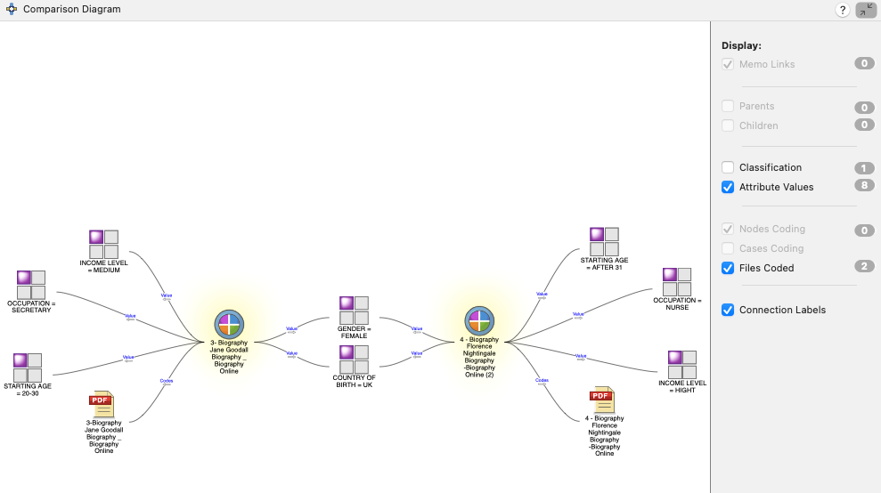

    Right click on the image and export the diagram to your computer. 
    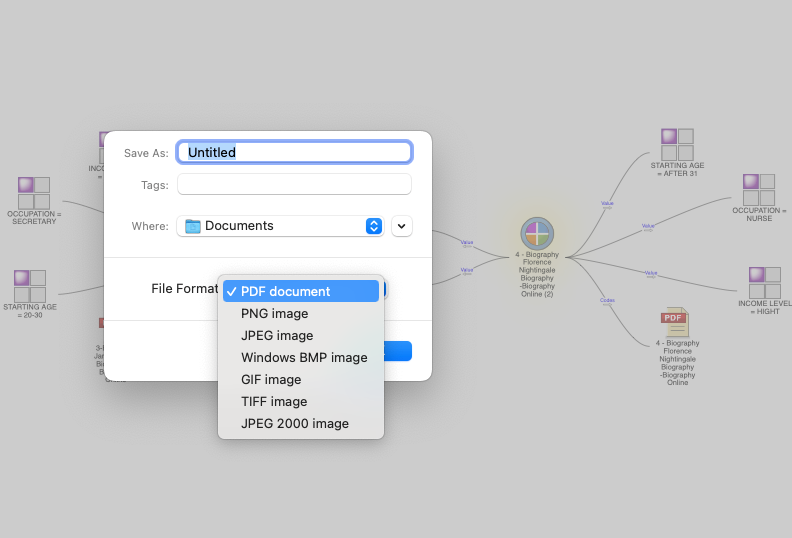

24.	**SAVING AND EXPORTING YOUR PROJECT.** On the top of your screen go to **FILES,** then click **SAVE.** Once you have saved your project, export it by clicking on the option **EXPORT PROJECT.** 

**Well done! You have now completed your advanced NVivo Workshop!**

[NEXT STEP: Earn a Workshop Badge](informal-credentials.html){: .btn .btn-blue }