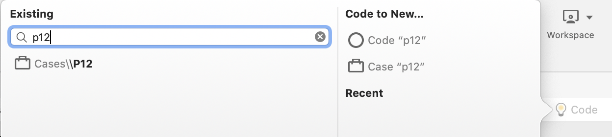
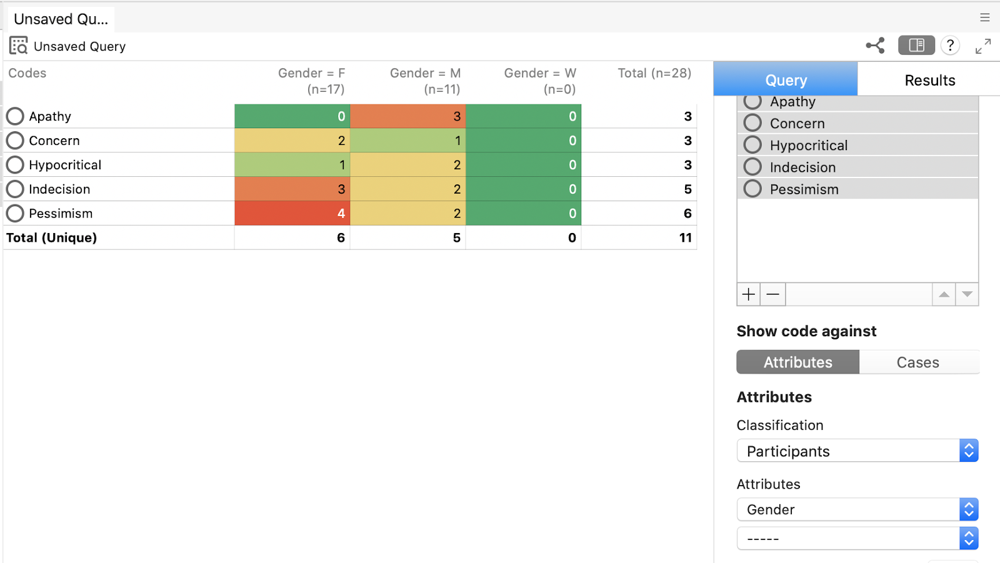
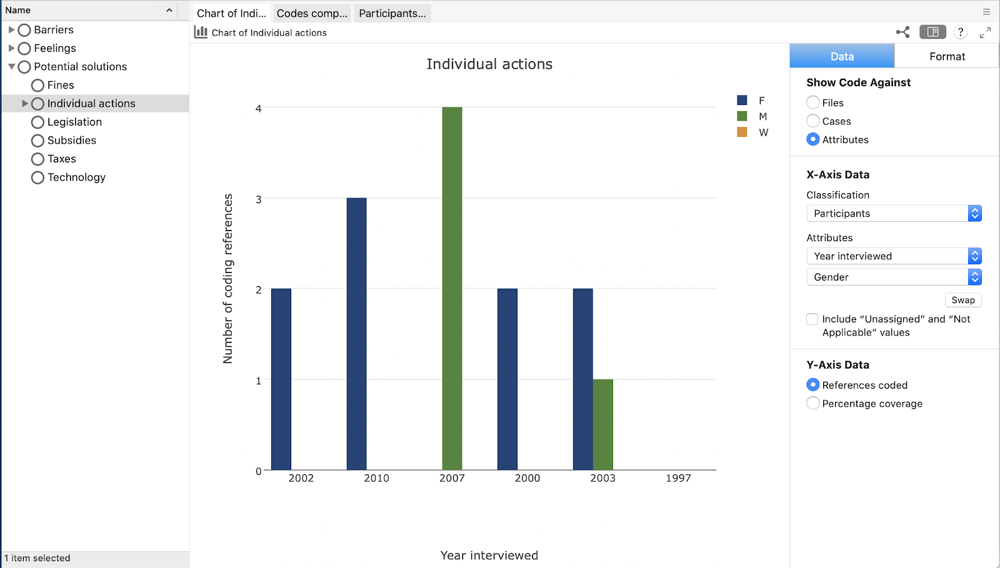
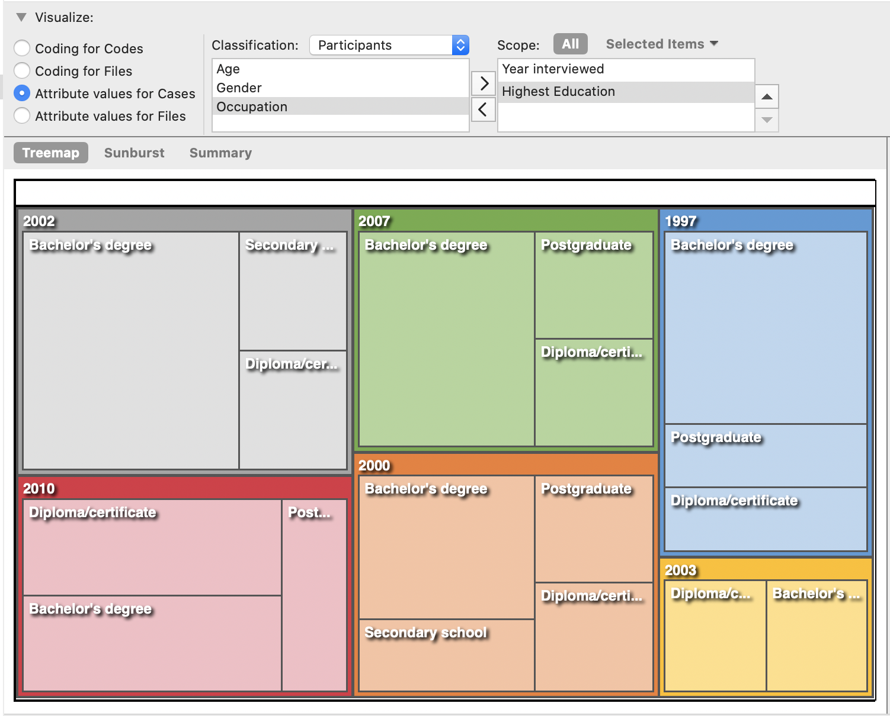

<!--archived-->
# Group Interview Data: Tracking Public Understanding of Climate Change Over Time
## Mac Version

If you have NVivo-specific questions, they might be addressed in the Quick Guide section of this workshop. If you have any questions or get stuck as you work through this in-class exercise, please ask the instructor for assistance. Enjoy!

### A) Creating a project and navigating the workspace

1.  Open NVivo and select Create a New Project.
2.  In the dialogue box that opens, save your project as “Public Understanding of Climate Change”.
3.  Choose where to save your project.
4.  Click Create Project

### B) Importing Codes

A code is a collection of references about a specific theme, case or relationship. You gather the references by 'coding' sources to a code. Since we covered this in our [introductory NVivo workshop](https://uviclibraries.github.io/nvivo/){:target="_blank"}, this time we will be importing a hierarchy of codes from a pre-coded file to save time.

1.  Select the Import tab on the top ribbon, and then select project
2.  Navigate to the Activity 2 Sources folder you saved locally to your desktop. Select MAC - Public understanding of climate change.nvpx and click Import.
3.  From the Navigation Pane, under Codes, select Codes to view the imported codes.

### C) Import classification sheet

In NVivo, you can create case codes to represent different units of analysis, including interview subjects, documents, organizations, places, or any other entity you want to compare and analyze.

**Case Classification vs. File Classification**
-   **Case classifications** store attributes about your units of analysis (e.g. demographic information about interviewees, company information, etc.).
-   **File classifications** store attributes about your materials being analyzed (e.g. interview transcripts, newspaper articles, reports, etc.).

**Case Classifications:** If you have gathered information about your case nodes outside of NVivo—and the information is in a structured text file or a spreadsheet—you can import it into NVivo by importing a classification sheet. For example, if you have cases representing people, and you have recorded demographic information about these people in a spreadsheet, then you can import this classification data. If you don’t have a spreadsheet you can also input this information manually - see [instructions from NVivo](https://help-nv.qsrinternational.com/20/mac/Content/classifications/create-case-classifications.htm?Highlight=case%20classifications){:target="_blank"}.

1.  In the Top Ribbon Choose Classifications under Import, and then Classification sheet.
2.  Navigate to the text file that contains the data you want to import. (Attribute matrix - Tracking public understanding of climate change over time.txt
3.  This opens the Import Classification Sheets Assistant
4.  Select case classification under classification type, then select
    -   For text files: Create new classifications and enter a name for the classification sheet: Participants
    -   Create new attributes if they do not exist
    -   Click Next and then Import
5.  From the Navigation Pane, under Cases, select Cases to view the imported cases (attributes about the participants)

### D) Applying Case Nodes

1.  Code the interview file according to the new case codes. For example, open the file from the Navigation Pane and highlight the first response by P1. Right click and select Code Selection, to Existing Cases or codes.
2.  In the dialogue box that appears, select “Cases” and then the “P1” case. Click Select. Repeat these steps for all responses for each of the participants.
3.  **Quick coding shortcut:** Using the lightbulb icon or the Command / shortcut can be a quick way to code text. Select the text in your file you wish to code, then click the lightbulb of Command / In “Existing”, type the name of the Case (as you start typing, name of nodes will start to show up), and then click enter on your keyboard.

    

### E) Crosstab query

1.  Cross-tab queries allow you to explore your coding across Cases and Attributes. Let’s explore the distribution of theme nodes across our Participants (Cases).
2.  **Feelings x Gender:** On the top ribbon, under the Explore tab, click the Queries icon, and then Crosstab. In the Crosstab Criteria form that appears, enter the following criteria:
    -   Show codes against “Attributes”
    -   Display the codes in the list view and drag all of the codes under the “Feelings" category into the Codes field.
    -   Set Classification to “Participants” and Attribute 1 to “Gender”.
    -   Click Run Query.

    

3.  By default, the crosstab results display the number of cases each node has been attributed two per attribute.
4.  You can customize the analysis and colour coding scheme using options in the menu when you right click on the table or by clicking on the Results tab in the detail pane. You can also switch the results to display number of coding references or presence/absence, and switch cell values from counts to percentages.
5.  Play around with other combinations of codes and attributes. Identify any interesting patterns.
6.  To save a static version of your query results, click the Save Results button under Query in the detail pane. A saved copy will now appear in the Queries results folder, under the Queries heading in the navigation pane.
7.  To save the query setup to continue modifying at a later time, click the Save Criteria button. The results will be saved in the Query criteria folder under the Queries heading in the navigation pane.

### F) Creating Visualizations

Visualizations in NVivo for Mac are fairly limited. It is not possible to visualize query results or perform a cluster analysis. Charting is available but offers less options than Windows.

1.  **Charts:** You can use charts to visualize Coding for a file, Coding for a code, or Coding by attribute value for a code.
    -   In List View, select the file or code you want to chart. On the Explore tab, in the Visualizations group, click the Chart image.
    -   The chart is generated and displayed in Detail View.
    -   You can use the chart options panel (on the right) to change the data displayed in the chart, or to change the chart's format and appearance.

    

2.  **Hierarchy Charts:** help you visualize a hierarchy, helping you to see patterns in your coding or view the attribute values of cases and files. Create a hierarchy chart by clicking Hierarchy Chart in the Visualizations group on the Explore tab.

    

### G) Exporting materials

1.  **Project export:** In the top ribbon, under Share, click the Export Project icon. In the dialogue box that appears, you can browse to select where to save the file.
2.  **Individual item export:** You can also export the codebook and other content generated in NVivo as individual files. In the top ribbon, under Share, click the Export icon and select Export Codebook. In the dialogue box that appears, select codes, then you can browse to select where to save the file. You can choose to save the file as either in MS Word format (*.docx) or MS Excel (*.xlsx).

### H) Saving your workspace

1.  Your workspace is saved by NVivo as a *.nvpx file. All of your files and outputs are saved as part of your workspace. To save click File above the top ribbon, then select save. If you need to copy your workspace to another location, select Copy Project under the Explore tab.

[NEXT STEP: Exploring Cases and Case Classifications](act-2-cases.html){: .btn .btn-blue }
