# Exploring Cases and Case Classifications

1.	Make sure you have downloaded NVivo to your computer. **There is an annual fee of $100 for UVic graduate students, faculty, and staff to use NVivo.** 
- [Licenses can be purchased here.](https://www.uvic.ca/systems/services/pages/analytics-and-bi.php#ipn-nvivo) 
- Note that license requests require approval, which may take up to a week to process.
- Alternatively, you can [download a trial version of the software.](https://lumivero.com/resources/free-trial/nvivo/) The trial is free for fourteen days.

2.	**Launch NVivo.**
When the program opens, click **New Project.** 

    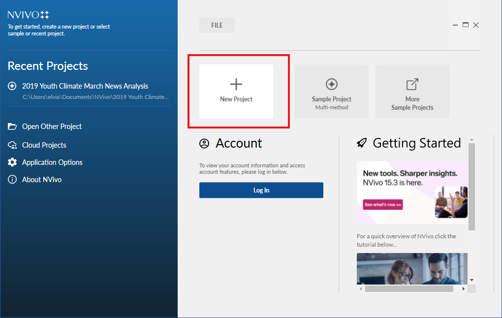

3.	**Set up your project.**
In the project setup window, enter a project name, choose a save location, and add a description. For this exercise, we recommend naming your project **Biography Analysis.**
   
    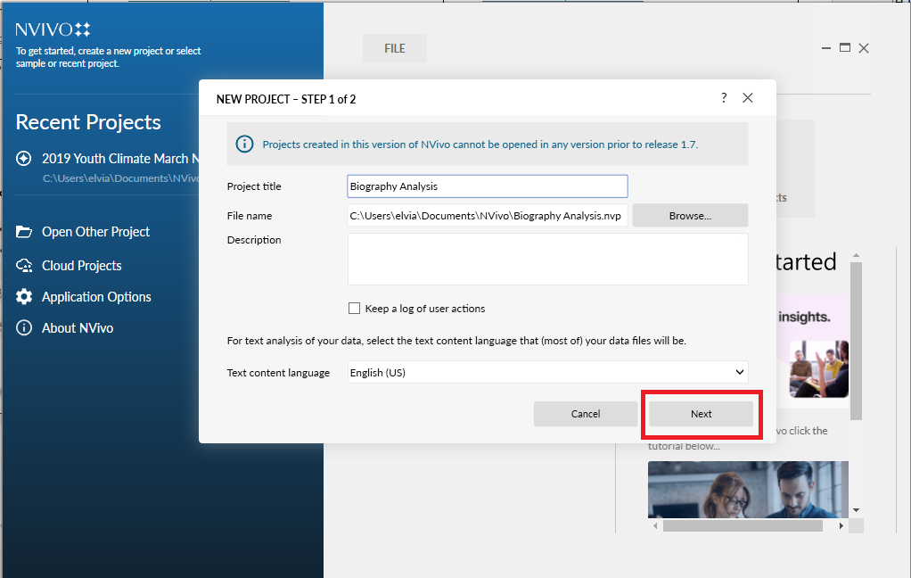

4.	**Enter the NVivo workspace.**
After creating your project, NVivo will open the main project workspace. If you are using a UVic NVivo license, your interface may look like the image below. If you are using a commercial or trial version, the layout may vary slightly.

    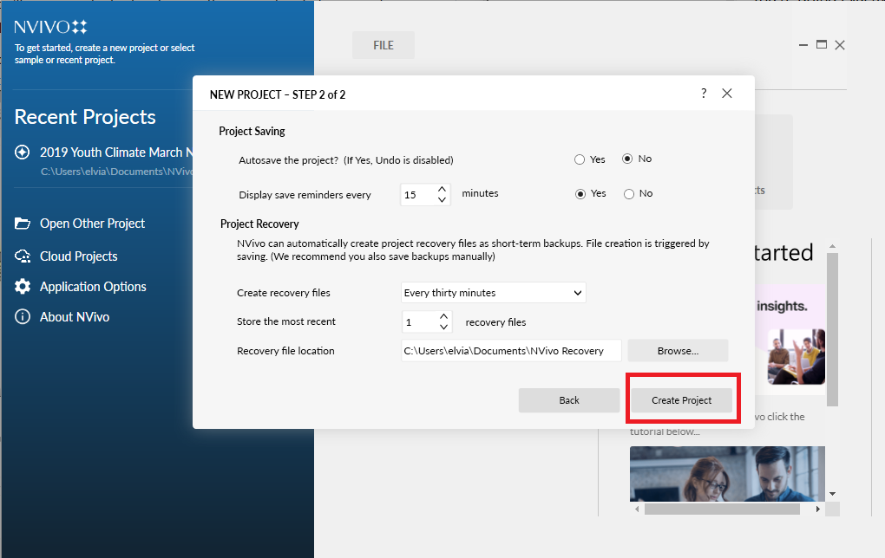

5. **Create a folder in Files.**
In the left navigation pane, right-click **Files** and select **New Folder.**

     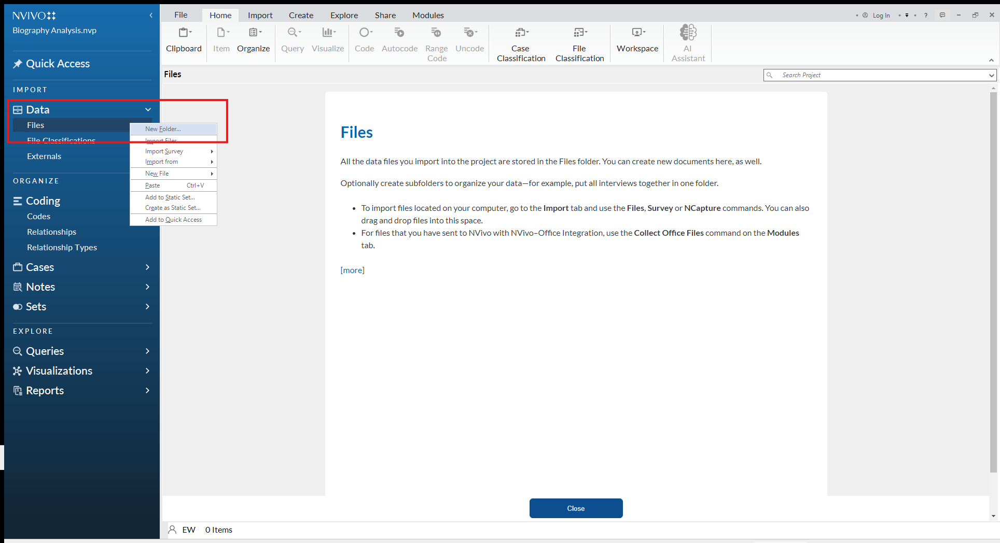

6. **Name your folder.**
Name the folder **Biographies.** You may optionally add a folder description, then click **Done.**
Creating folders helps keep your NVivo workspace organized, especially when working with multiple NVivo project files for the same study.

    

7. **Download source files.**
With the NVivo workspace set up, you can now import files into your project. Download the Word documents provided below and save them to your computer.
    [Link to the documents](https://drive.google.com/drive/folders/1CAhi674fobzj0A9N2TTQ4ifPKHsABDXC?usp=sharing)

8. **Import documents into NVivo.**
Once the documents are saved on your computer, import them into your NVivo project. This follows the same procedure used in the introductory NVivo workshop.
Select the **Biographies** folder you just created, then go to the top ribbon and choose **Data > Documents**. When the import window opens, select the files from your computer and click **Import**.

    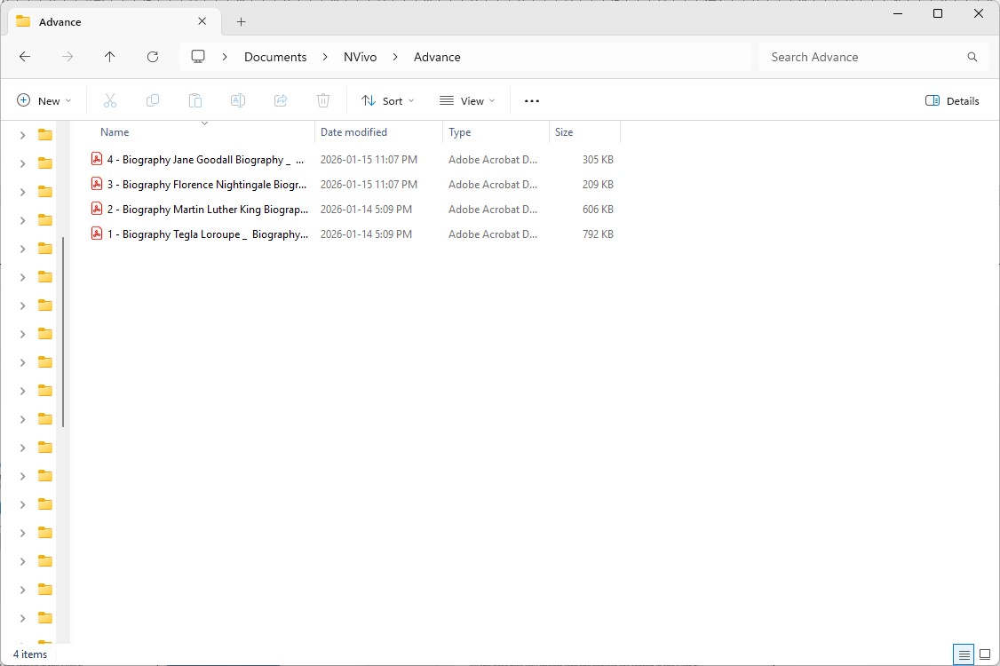
    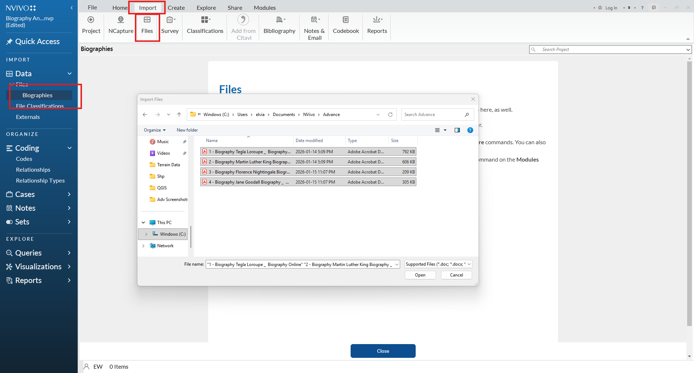
    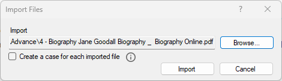
    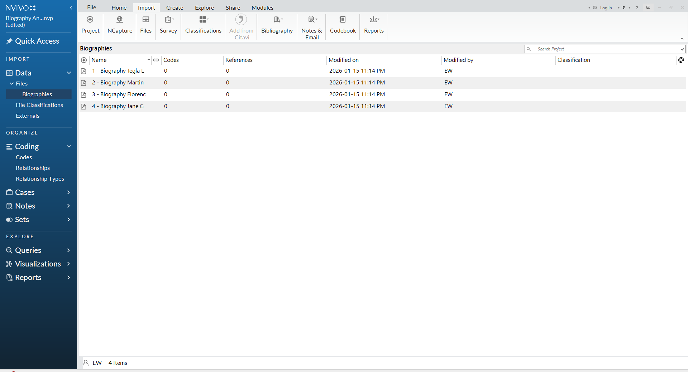

   Cases represent the units of analysis in your research, for example, the people you interviewed, the communities you studied, or the organizations or events you’re analyzing. Creating cases allows you to assign attributes (such as age, country, role, or group) to each one, so that later you can compare themes across participants or contexts.

9. **Create cases from your files.**
With your files imported, the next step is to convert them into cases. This allows you to assign classifications and attributes to each document and begin more detailed analysis.
There are multiple ways to create cases in NVivo. For this guide, we use a clear and structured approach that supports learning and keeps the NVivo workspace organized.

    To create individual cases from your files:
   
   - a. In the Navigation Pane, select the Biog**r**aphies folder under **Files**.
   - b. In the List View, select all files.
   - c. Right-click the selected files.
   - d. Choose **Create As > Create as Cases.**
   - e. In the **Select Location** dialog box, choose the desired location and click **OK**.

    Your selected files are now converted into individual cases and will appear under **Cases** in the Navigation Pane.
    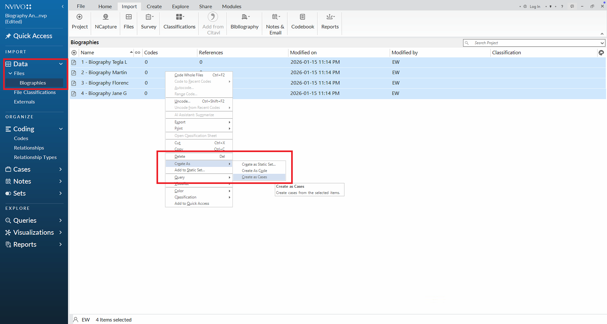
    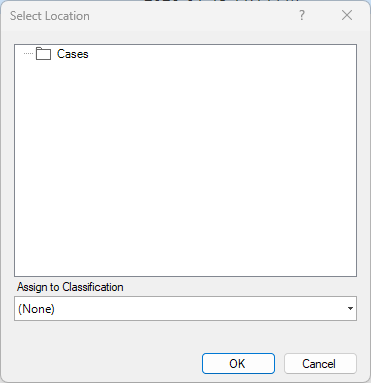

10. **View your cases.**
To view your cases, select Cases in the Navigation Pane. Each document has now been converted into an individual case, which you can explore and analyze further.

    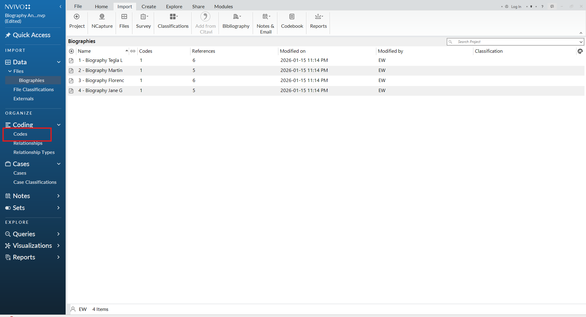

    A **case classification** is a structured table used to store objective information (attributes) about your cases, such as demographic or contextual details. Classifications allow you to compare cases systematically and support analysis and visualization later in NVivo.

11. **Create a case classification.**
With your cases created, the next step is to set up a case classification to record objective information.
   - a. Select **Case Classifications** in the Navigation Pane.
   - b. In the Detail Pane, right-click.
   - c. Choose **New Classification.**

    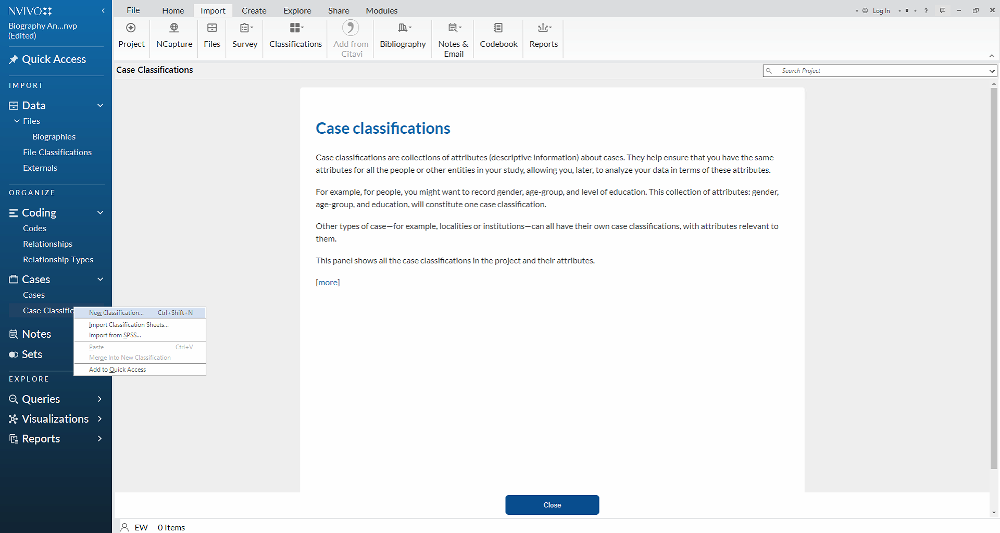

12. **Name your case classification.**
Name the classification **Attributes for Biographies Analysis**, then click **Ok.**

    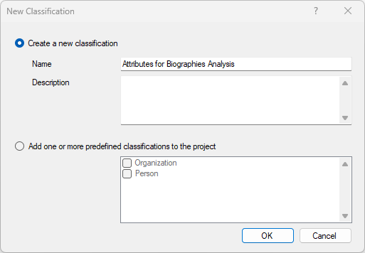

13. **Add attributes to the case classification.**
Next, add attributes to the biography case classification to record objective information drawn from the documents.
For this exercise, you may include attributes such as gender, country of birth, income level, education level, region, century, and impact level, among others. In your own projects, you can define as many attributes as needed, depending on your research questions.
To add an attribute:
    - Select the newly created case classification (**Attributes for Biographies Analysis**), right-click, and select **New Attribute**.

    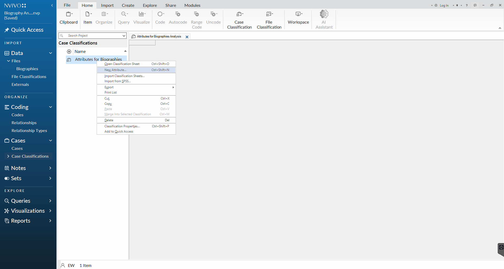

14. **Create attributes values.**
Create the following attributes using the **New Attribute** dialog box. Attribute values are defined in the **Values** tab. You may add as many attributes and attribute values as needed.
To create an attribute:
    - a. In the **New Attribute** dialog box, enter a **Name** for the attribute.
    - b. Select the **Values** tab and click **Add** to define values (if applicable).
    - c. Click **OK**.

    Repeat these steps to create the following attributes and values:
     -  **Gender** (Male, Female, Other)
     - 	**Income Level** (Low, Medium, High)
     - 	**Occupation**
     - 	**Starting Age** (0–10, 11–20, 21–30, More than 30)
     - 	**Country of Birth**
     - 	**Race/Ethnicity** (Indigenous, Afro-descendant, Caucasian, Person of Color)

    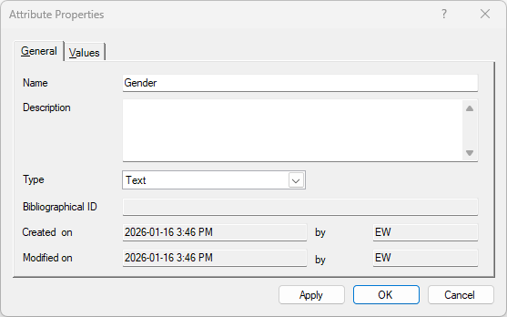
    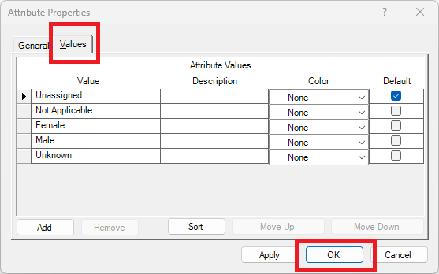
    

15. **Assign the classification to your cases.**
With the classification sheet created, the next step is to link it to your cases so that attributes can be assigned.
To do this:
    - a. In the Navigation Pane, select **Cases.**
    - b. Select all cases.
    - c. Right-click the selected cases.
    - d. Scroll to **Classification** at the bottom of the menu.
    - e. Choose **Attributes for Biographies Analysis** (or the name of the classification you created).
NVivo will process the command and link each case to the classification sheet.

    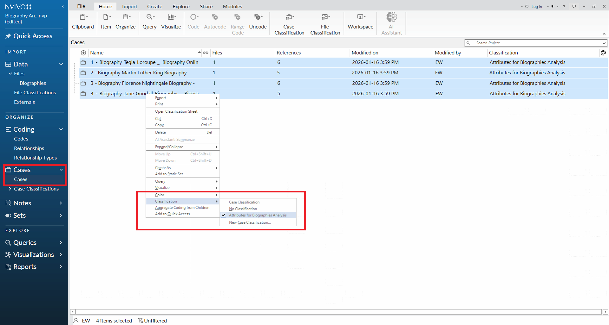

16. **Open the classification sheet.**
    - a. In the Navigation Pane, select **Case Classifications.**
    - b. In the List View, double-click **Attributes for Biographies Analysis.**
    - c. The classification sheet will open in the right-hand pane of the NVivo interface.

    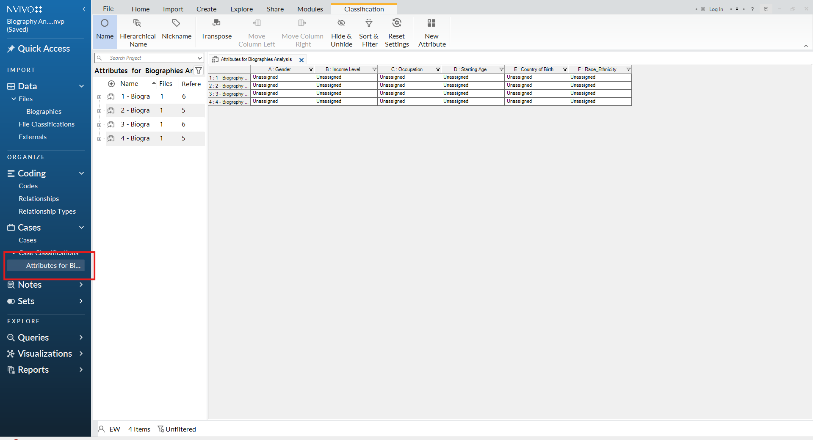

17. **Assign attribute values and begin analysis.**
With the classification sheet open, you can now begin assigning attribute values to each case. Under each attribute, you will see an **Unassigned** value.
To complete the classification:
- Read through the documents to identify relevant information. Files can be accessed either under **Cases** in the Navigation Pane.
- In the classification sheet, click the **Unassigned** cell for each attribute and select or enter the appropriate value.
Some attributes include predefined values (as specified in Step 14). For attributes without predefined values, type in the information based on your analysis of the data.
Your completed classification sheet will resemble the example shown below. Note that attribute values may vary depending on your interpretation of the documents.

    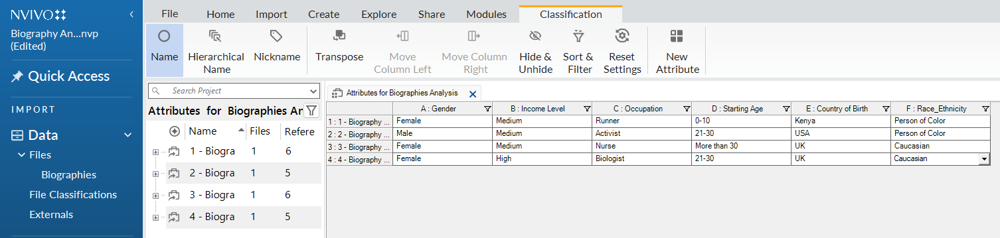

18. **Explore patterns using a hierarchy chart.**
You can now explore your data to identify patterns, differences, and trends across cases.
To create a hierarchy chart:
    - a. Go to the **Explore** tab on the main ribbon.
    - b. Select **Hierarchy Chart**.
    - c. In the **Hierarchy Chart Wizard** dialog box, select **Cases**, and click **Next** button.
    - d. In the next page, select the case classification (Attributes for Biographies Analysis), and choose an attribute (variable) and click **Finish**. 
A treemap visualization will appear, showing the distribution of cases by the selected attribute (for example, country of birth). You can add additional attributes by selecting them and clicking the > button.
    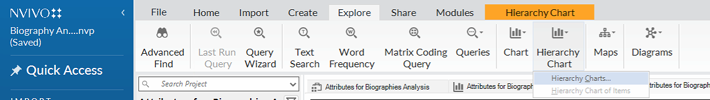
    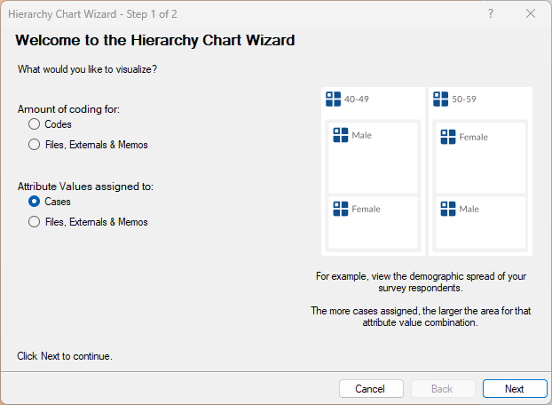
    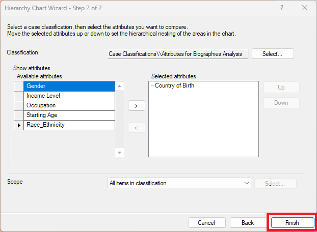

    As you add more attributes, the treemap will update and group cases accordingly. Take a moment to explore how the visualization changes as different attributes are included. Your results may differ depending on how attributes were assigned.

    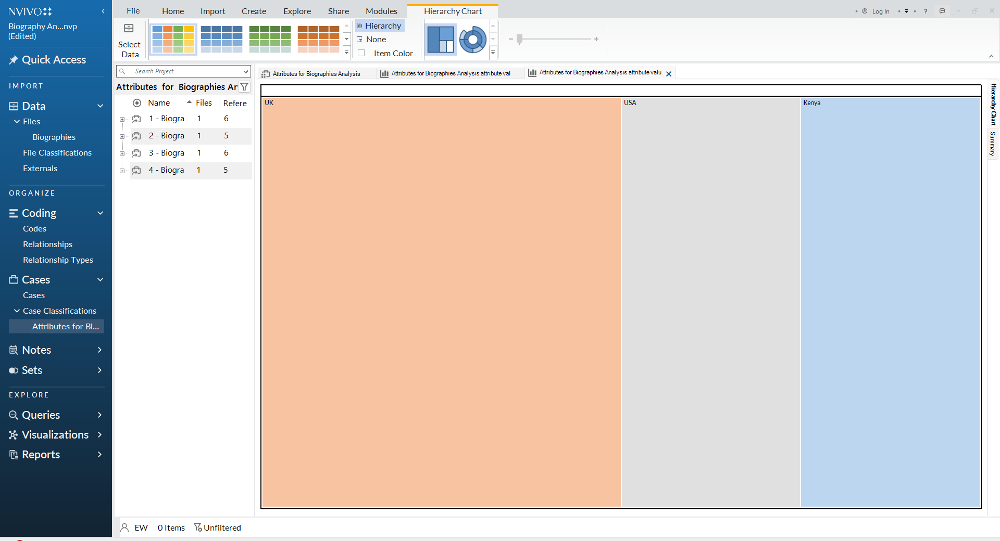

19. **Explore the data using a sunburst visualization.**
To continue exploring your data, select the **Sunburst** visualization option next to the treemap. This provides an alternative view of how cases are distributed across the selected attributes.
    - a. Go to **Explore → Hierarchy Chart** (as in your previous step).
    - b. Once the **Hierarchy Chart** (Treemap) is displayed, look at the **top-left corner of the visualization panel.**
    - c. You will see **visualization icon**:
    - **Treemap** (default)
    - **Sunburst** (circular icon next to Treemap)
    - d. Click the **Sunburst** icon to switch views.

    

20. **Explore the data using a summary visualization.**
Select the **Summary** visualization option to view an aggregated overview of how cases are distributed across the selected attributes.

    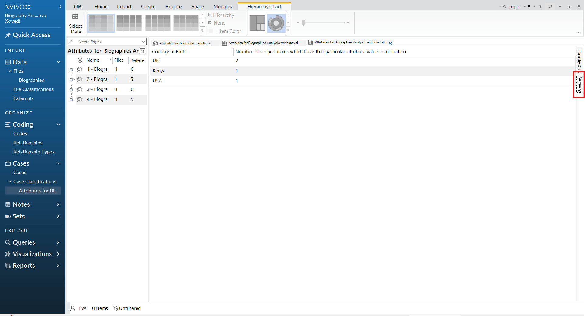

21. **Export visualizations.**
Visualizations created in NVivo can be exported to your computer. Select a visualization, then choose **Export.** From there, select your preferred file format (e.g., PDF, PNG, JPEG).

    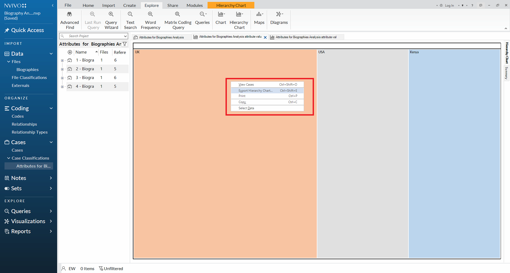
    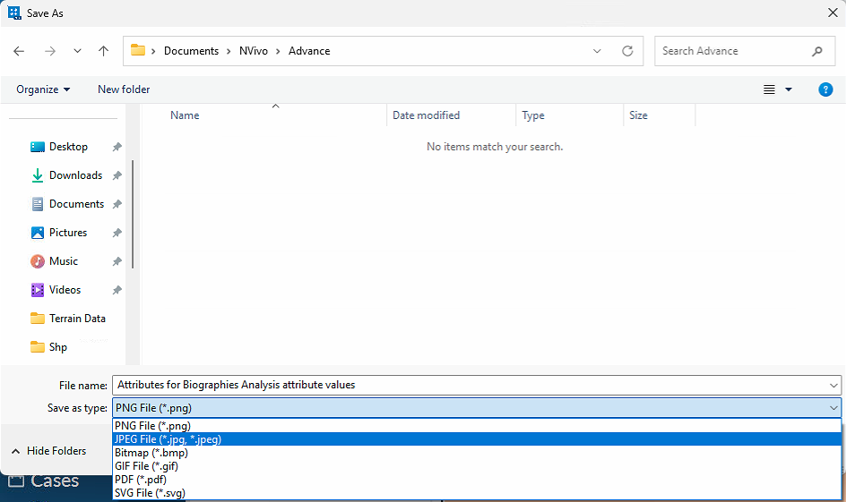

22. **Compare cases.**
You can compare attribute values across cases to identify similarities and differences.
To compare cases:
    - a. On the top ribbon, select **Explore.**
    - b. Choose **Diagrams.**
    - c. Select **Compare Cases**. In the **Select Project Items** dialog box, choose the cases for **Jane Goodall** and **Florence Nightingale**, then click **OK**.

    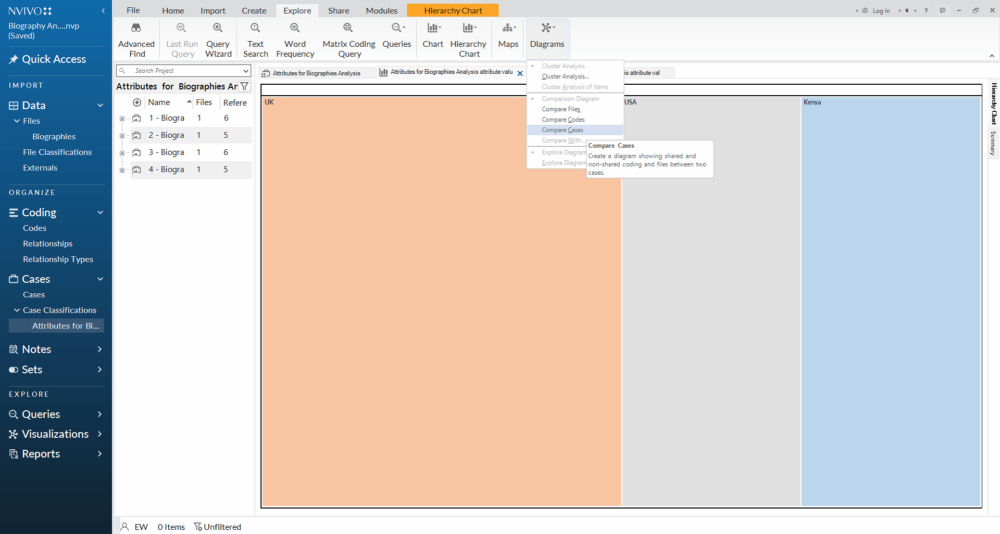
    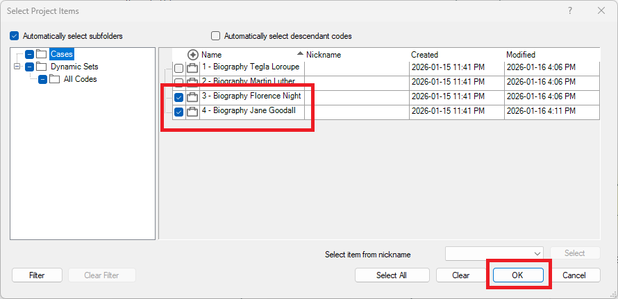

    Once the comparison diagram is generated, a basic view will appear showing the connection between each case and its associated file. In the **Comparison Diagram** tab, select **Attributes values**.
This view provides a more detailed comparison, displaying attribute values side by side and highlighting similarities and differences between the selected cases, as shown in the example below.

    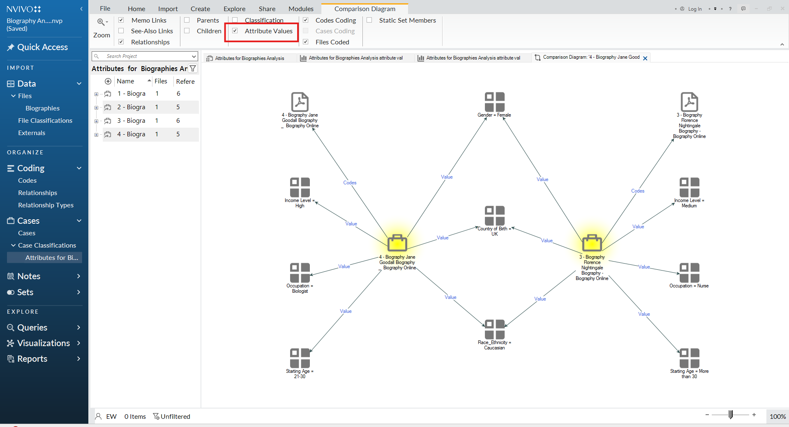

    **Right-click the diagram and select Export** to save it to your computer.
    

23. **Saving and exporting your project.**
**Save your project:**
    - a. Go to the **File** menu at the top of the screen.
    - b. Select **Save** to ensure all changes are stored in your project file.

    **Export your project:**
    - a. Go to the **File** menu.
    - b. Select **Copy Project.**
    - c. Choose a location on your computer and click **OK**.
    This creates a copy of your NVivo project file (.nvp) that can be shared or stored as a backup.

**Well done!**

You have now completed the **Advanced NVivo Workshop.**

[NEXT STEP (Optional): Qualitative Coding with Generative AI](act-2-genai.md){: .btn .btn-blue }

[NEXT STEP: Earn a Workshop Badge](informal-credentials.html){: .btn .btn-blue }
