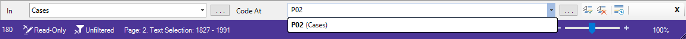
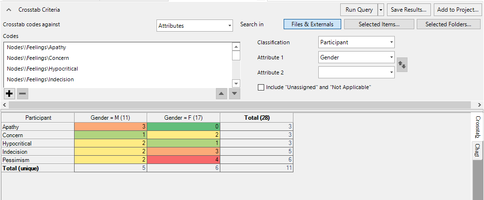
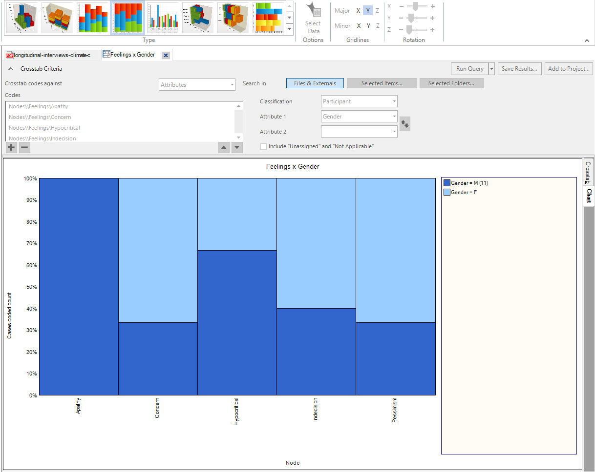
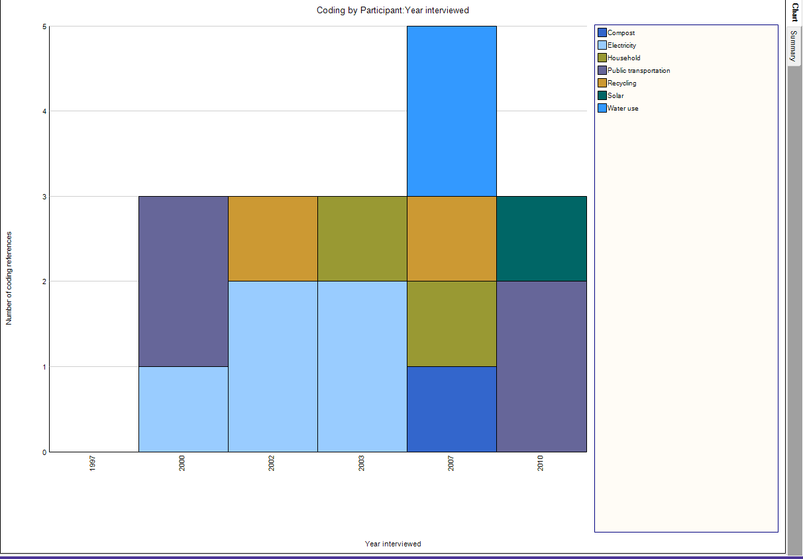
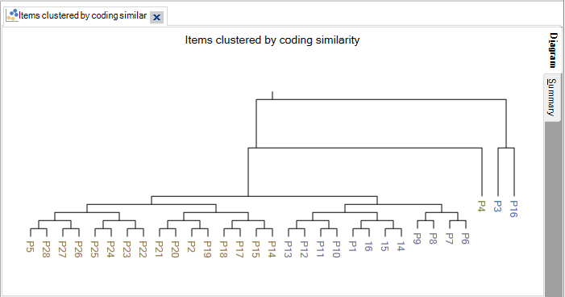

<!--Archived

# Group Interview Data: Tracking Public Understanding of Climate Change Over Time
## Windows Version

If you have NVivo-specific questions, they might be addressed in the Quick Guide section of this workshop. If you have any questions or get stuck as you work through this in-class exercise, please ask the instructor for assistance. Enjoy!

-   **Download workshop files** (<1 min):
    -   **Windows Files:**
        -   <a href="resources/WINDOWS - Attribute matrix - Tracking Public Understanding of Climate Change Over Time .xlsx" download="windows_attribute_matrix">Attribute Matrix</a>
        -   <a href="resources/WINDOWS - Public understanding of climate change - nodes.nvp" download="windows_nodes">Nodes</a>
    -   **Mac Files:**
        -   <a href="resources/MAC - Attribute matrix - Tracking Public Understanding of Climate Change Over Time_.txt" download="mac_attribute_matrix">Attribute Matrix</a>
        -   <a href="resources/MAC - Public understanding of climate change - nodes.nvpx" download="mac_nodes">Nodes</a> 

### A) Creating a project and navigating the workspace

1.  Open NVivo and select **“Blank Project”**.
2.  In the **“New Project”** dialogue box that opens, enter a title for your project **“Public Understanding of Climate Change”**.
3.  Next to the File name field, select where to save your project file with **“Browse…”**.
4.  Check the box next to **Write user actions to project event log** (this will keep track of your methodology and retrace your steps later on). Click **OK** when finished.

### B) Importing Nodes

A node is a collection of references about a specific theme, case or relationship. You gather the references by 'coding' sources to a node. Since we covered this in our [introductory NVivo workshop](https://uviclibraries.github.io/nvivo/){:target="_blank"}, this time we will be importing a hierarchy of nodes from a pre-coded file to save time.

1.  Select the Import tab on the top ribbon, and then select project.
2.  Navigate to the Activity 2 Sources folder you saved locally to your desktop. Select Activity 2 - Climate Change Focus Group Coding.nvp and click Open.
3.  Under select the project items to import choose all.
4.  Select Import.
5.  From the Navigation Pane, under Codes, select Nodes to view the imported Nodes.

### C) Import classification sheet

In NVivo, you can create case nodes to represent different units of analysis, including interview subjects, documents, organizations, places, or any other entity you want to compare and analyze.

**Case Classification vs. File Classification:**
-   **Case classifications** store attributes about your units of analysis (e.g. demographic information about interviewees, company information, etc.).
-   **File classifications** store attributes about your materials being analyzed (e.g. interview transcripts, newspaper articles, reports, etc.).

**Case Classifications:** If you have gathered information about your case nodes outside of NVivo—and the information is in a structured text file or a spreadsheet—you can import it into NVivo by importing a classification sheet. For example, if you have cases representing people, and you have recorded demographic information about these people in a spreadsheet, then you can import this classification data. If you don’t have a spreadsheet you can also input this information manually - see [instructions from NVivo](https://help-nv.qsrinternational.com/12/win/v12.1.90-d3ea61/Content/classifications/create-case-classifications.htm){:target="_blank"}.

1.  In the Top Ribbon Choose Classification Sheet under Import, this opens the Import Classification Sheets Wizard (4 steps).
2.  Step 1 of 4: Click the Browse button, and then locate and select the text file or Excel workbook that contains the data you want to import. (Attribute matrix - Tracking public understanding of climate change over time.xlsx).
3.  Step 2 of 4: Select case classification under classification type, then select (Create new attributes if they do not exist).
4.  Step 3 of 4: In this step you specify the format of source or case node names in the file you are importing.
    -   Select as names. Select this option if the first column of your file contains only the names of your sources or nodes. you must also select the folder location— Click Select to change the folder location.
    -   Select Create new sources (or cases) if they do not exist
5.  Step 4 of 4: Under Attribute Value Format, select the values that you want to be interpreted as 'Unassigned' and 'Not Applicable' values. You can leave these as is and click finish.

### D) Applying Case Nodes

1.  Code the interview file according to the new case nodes. For example, open the file from the Navigation Pane and highlight the first response by P1. Right click and select Code… In the dialogue box that appears, select “Cases” and then the “P1” case. Click OK. Repeat these steps for all responses for each of the participants.
2.  **Quick coding bar:** The coding bar at the bottom of the workspace can be a quick way to code text. Select the text in your file you wish to code, then on the quick coding bar, select “In Cases”. In “Code At”, type the name of the Case (as you start typing, name of nodes will start to show up), and then click enter on your keyboard.

    

### E) Crosstab query

1.  Cross-tab queries allow you to explore your coding across Cases and Attributes. Let’s explore the distribution of theme nodes across our Participants (Cases).
2.  **Feelings x Gender:** On the top ribbon, under the Explore tab, click the Crosstab icon. In the Crosstab Criteria form that appears, enter the following criteria:
    -   Crosstab codes against “Attributes”
    -   Display the nodes in the list view and drag all of the nodes under the “Feelings" category into the Codes field.
    -   Set Classification to “Participant” and Attribute 1 to “Gender”.
    -   Click Run Query.

    

3.  By default, the crosstab results display the number of cases each node has been attributed two per attribute.
4.  You can customize the analysis and colour coding scheme using options in the top ribbon. You can also switch the results to display number of coding references or presence/absence, and switch cell values from counts to percentages.
5.  Play around with other combinations of codes and attributes. Identify any interesting patterns.
6.  To save a static version of your query results, click Save Results...  A saved copy will now appear in the Queries results folder, in the navigation pane under the Search header.
7.  To save the query setup to continue modifying at a later time, click the “Add to Project” button. The results will be saved in the “Queries” folder under the Search heading in the navigation pane.

### F) Creating Visualizations

1.  **Visualizing Query Results:** NVivo automatically creates visualizations for Queries. Re-open your Feelings x Gender Crosstab  Query. On the right-side of the results summary, click the “Chart” tab.. By default, NVivo will create a 3D chart visualization to represent your results. This can be changed or customized using the Chart tools displayed on the Top Ribbon.

    

2.  **Custom charts - Timelines:** To build a custom Chart to visualize your data, under the Explore tab, click the Chart icon. In the Chart Wizard that appears, for Step 1, create a Coding chart. For Step 2, select “Coding by case attribute for multiple codes”. For Step 3, select all Nodes under the “Potential Solutions > Individual Actions” category. Set the X-axis attribute to the “Year Interviewed” case attribute and display “All attribute values except ‘Unassigned’, ‘Not Applicable’. For the Y-axis, select “Number of coding references”.

    

3.  **Cluster Analysis of Cases:** To compare the similarity of the cases, try running a cluster analysis. On the Top Ribbon, click then Explore tab, then click the Cluster Analysis icon. A dialogue box for the Cluster Analysis Wizard should appear. Click the “Codes” option then click Next. Select all Cases as nodes to analyze, and cluster them by “Coding similarity”. Click OK to run.  On the top ribbon you can change the plot type and modify the number of clusters.

    

### G) Exporting materials

1.  **Reports and Extracts:** NVivo automatically generates a series of reports to summarize your work. In the navigation pane, expand the Output heading. Two options should be listed: reports and extracts. Reports are meant to be read as documents, whereas extracts can be imported into spreadsheets.
2.  Click the Reports icon in the navigation pane. A series of reporting options should appear in the file list pane. Let’s create a report summarizing our coding scheme. Click “Coding Summary by Code Report”. In the Filter Options dialogue box that appears, click OK. In the detail pane, a document should open, which summarizes information on each of the codes in the hierarchy, and lists the coded text.
3.  For comparison, click the Extracts icon in the navigation pane. Click “Coding Summary by Code Extract” in the file list pane. In the Filter Options dialogue box that appears, click OK. NVivo will ask you to save this document locally as a *.txt file. This file can now be opened by programs like Excel. Column structure is maintained by comma delineation.
4.  **Individual item export:** You can also export the codebook and other content generated in NVivo as individual files. In the navigation pane, under Codes, right click Nodes and select Export Codebook. In the dialogue box that appears, you can browse to select where to save the file. You can choose to save the file as either in MS Word format (*.docx) or MS Excel (*.xlsx).

### H) Saving your workspace

1.  Your workspace is saved by NVivo as a *.nvp file. All of your files and outputs are saved as part of your workspace. To save click File above the top ribbon, then select save. If you need to copy your workspace to another location, click File and then select Copy Project.
2.  To review your actions taken in the workshop click File above the top ribbon, then click Open Project Event Log.

[NEXT STEP: Exploring Cases and Case Classifications](act-2-cases.html){: .btn .btn-blue }
-->